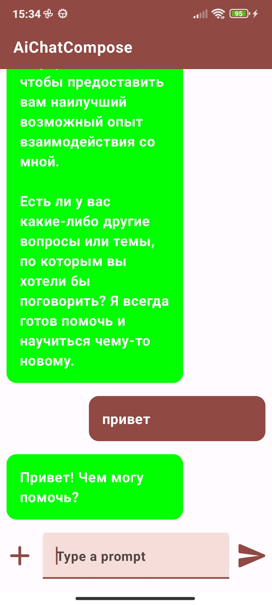
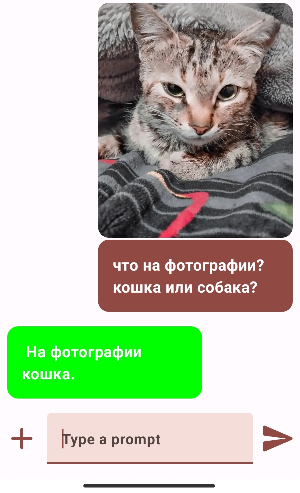
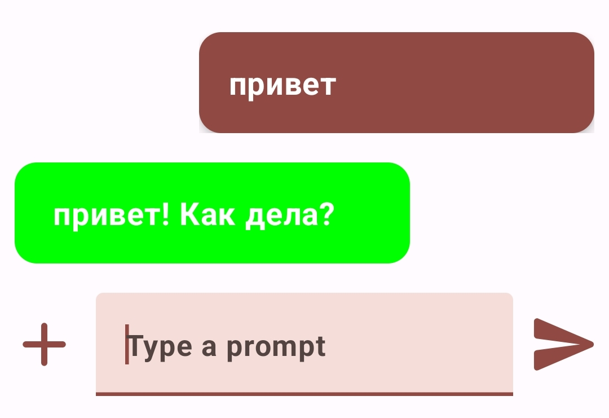
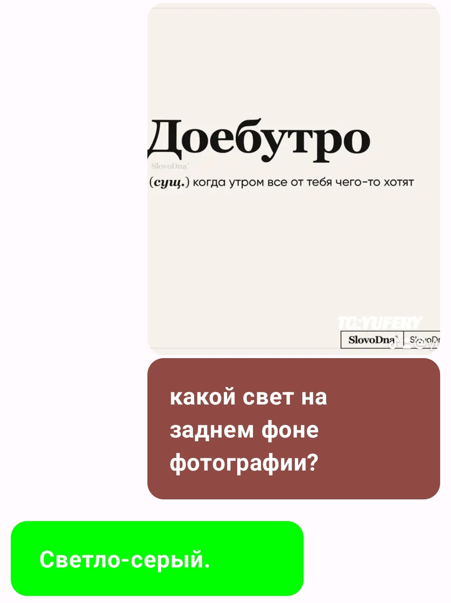

# AiChatCompose


## О приложении
AiChatCompose - это приложение для Android, разработанное с использованием Jetpack Compose, которое использует API AI Studio от Google для ответов на вопросы и анализа изображений.

## Особенности
- **Текстовый чат:** Задавайте вопросы и получайте ответы от искусственного интеллекта.
- **Анализ изображений:** Приложение способно анализировать изображения, определять задний фон и многое другое.

## Технологии
- Kotlin
- Jetpack Compose
- Retrofit для взаимодействия с API AI Studio
- Coil для загрузки изображений
- ViewPager2 для перелистывания изображений

## Инструкции по установке
1. Склонируйте репозиторий на свое устройство.
2. Откройте проект в Android Studio.
3. Запустите приложение на эмуляторе или физическом устройстве.

## Получение API ключа
Для использования приложения вам необходимо получить API ключ на [AI Studio от Google](https://makersuite.google.com/app/apikey). Замените заполнитель в файле `ChatData.kt` на ваш реальный ключ API.

```kotlin
object ChatData {
    val api_key = "ВАШ_РЕАЛЬНЫЙ_API_КЛЮЧ"
}
```
Copyright (c) [2024] [Yusuf Yuldashov]

## Возможности
- Текстовый чат: Задавайте вопросы и получайте ответы от искусственного интеллекта.
- Анализ изображений: Приложение также способно анализировать изображения, определять задний фон и многое другое.

## Скриншоты







